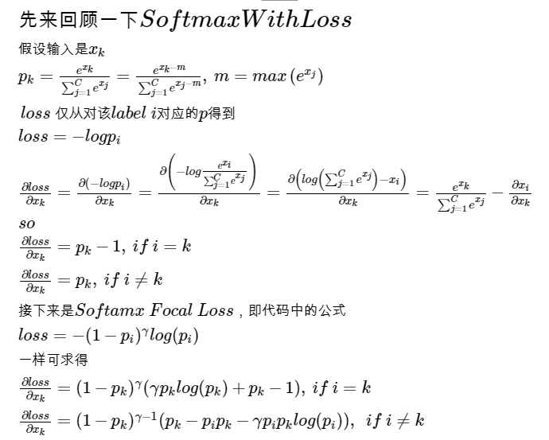

# FocalLoss
focal loss caffe version
## Usage
1. Update your caffe.proto and the code.
2. make -j4
3. usage of FocalLoss layer
```
#if your task is a 3-class classification problem
layer{
    name: "loss"
    type: "FocalLoss"
    bottom: "feature"
    bottom: "label"
    top: "loss"
    include {
        phase: TRAIN
    }
    focal_loss_param {
        alpha_balance: true
        gamma: 2
        alpha: 0.5 #background
        alpha: 1
        alpha: 1
    }
}

```
## Derivation 


## Reference
**Tsung-Yi Lin, Priya Goyal, Ross Girshick, Kaiming He, Piotr Dollár**, ***Focal Loss for Dense Object Detection***, [Paper Link](https://arxiv.org/abs/1708.02002)
